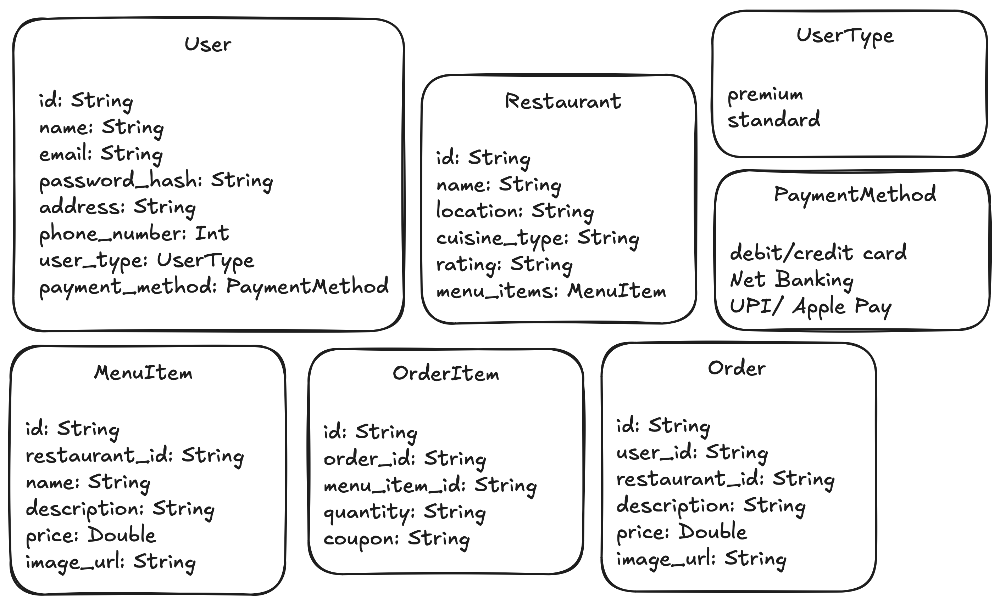
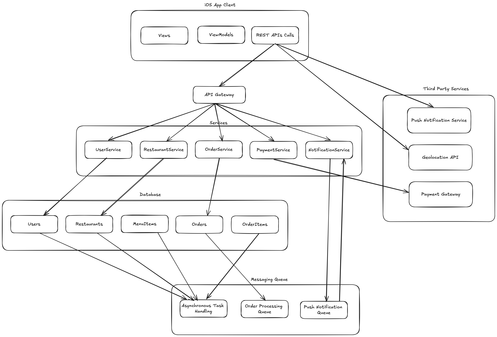

## 🧩 1. Gather Requirements (10–15 mins)

### ✅ Functional Requirements (FR):
Let’s break it down into the core modules:

#### 📱 User-side:
- User signup/login
- Browse/search restaurants and dishes
- Place/cancel orders
- Live order tracking
- Payment system
- Ratings/reviews for restaurants and delivery partners

#### 🍔 Restaurant-side:
- Add/edit menu items
- Accept/reject orders
- Manage restaurant profile, operating hours, delivery availability

#### 🛵 Delivery Partner:
- View assigned deliveries
- Navigation & delivery status updates
- Accept/reject delivery assignments

#### 🧠 Admin backend:
- Monitor overall system health
- Ban/unban users/restaurants
- Handle fraud detection, quality assurance

---

### ⚙️ Non-Functional Requirements (NFR):

| Feature                        | Requirement                          |
|-------------------------------|--------------------------------------|
| Scalability                   | Should handle millions of users     |
| Latency                       | <300ms for search, <1s for orders   |
| Consistency vs Availability   | Prioritize availability, use eventual consistency for things like tracking |
| Read/Write ratio              | 10:1 for browsing, 1:1 for orders   |
| High availability             | Yes (multi-region deployment)       |
| Security                      | Payments and PII must be encrypted  |
| Geo-distribution              | Users across multiple cities        |
| Fault tolerance               | Retry logic and fallback handling   |

---

## 📦 2. API Design (3–5 mins)

Here are some sample REST APIs for each stakeholder:

### 👤 User APIs
```http
POST /signup
POST /login
GET /restaurants?lat=..&lng=..&cuisine=..
POST /order
GET /order/:order_id/status
POST /rate/:restaurant_id
```

### 🍽️ Restaurant APIs
```http
POST /restaurant/login
POST /restaurant/:id/menu
GET /restaurant/:id/orders
PATCH /restaurant/:id/order/:order_id/status
```

### 🛵 Delivery Partner APIs
```http
POST /delivery/login
GET /delivery/assignments
PATCH /delivery/:id/order/:order_id/status
```

---

## 🏗️ 3. High-Level Design and Discussion (15–20 mins)

Let’s break it down by major components:

### 🎨 Clients:
- Mobile apps or web for: users, restaurants, delivery agents

---

### 🧊 CDN:
- Used for serving static content like restaurant images, app assets.

---

### 🧮 Load Balancer:
- Distribute traffic to microservices based on availability and routing logic.

---

### 🧰 Microservices:
| Service             | Description |
|---------------------|-------------|
| **User Service**    | Handles login/signup, user profile |
| **Restaurant Service** | Menu management, order reception |
| **Order Service**   | Order creation, status updates, communication between services |
| **Delivery Service** | Location tracking, delivery assignment |
| **Search Service**  | Text and geo-based search (Elasticsearch + geo index) |
| **Rating Service**  | Reviews, ratings, feedback |
| **Payment Service** | Integrates with third-party gateways |
| **Notification Service** | SMS, push notifications, etc. |

---

### 🗄️ Databases:
| Purpose           | DB Type | Justification |
|-------------------|---------|----------------|
| User profiles     | SQL (PostgreSQL) | Structured, relational |
| Menu & orders     | NoSQL (MongoDB) | Flexible, scalable |
| Location data     | Redis / PostGIS | Fast geo lookup |
| Reviews & Ratings | SQL / Document DB | Depends on volume and flexibility |
| Order History     | Cold storage (S3 + backup DB) | Archive old orders |


OR 

---

### 🚦 Queue Systems:
- **Kafka/SQS/RabbitMQ** used for:
  - Asynchronous order processing
  - Event-driven updates (e.g., "order placed", "order accepted")

---

### 🧠 Caching:
- Redis/Memcached for:
  - Frequently searched restaurants
  - Dish recommendations
  - Session caching

---

### 🗺️ Live Tracking:
- Use WebSockets or MQTT for real-time delivery tracking.
- Store location history temporarily for metrics/debugging.

---

## 📊 4. Metric Estimation (5 mins)

Let’s assume:
- 10M Daily Active Users
- 1M orders/day
- Peak: 100K concurrent users

| Metric             | Estimate |
|--------------------|----------|
| **QPS (Search API)**     | ~10K QPS |
| **QPS (Order API)**      | ~1K QPS |
| **Read/Write ratio**     | ~10:1 for browsing |
| **DB storage/year**      | ~10TB for orders, 1TB for user data |
| **Image CDN bandwidth**  | High (~10TB/month) |
| **Delivery tracking pings** | 2 pings/sec/agent × 100K = 200K writes/sec |
| **Servers needed**       | ~200–500 microservice nodes + autoscaling delivery workers |

---


### 🖼️ 5. High Level Design


---

✅ This system is modular, horizontally scalable, and built to handle high concurrency. From here, we could deep-dive into:
- Real-time tracking architecture (WebSockets)
- Dynamic delivery assignment (optimization algo)
- Search relevance and ranking
- Payment fraud handling