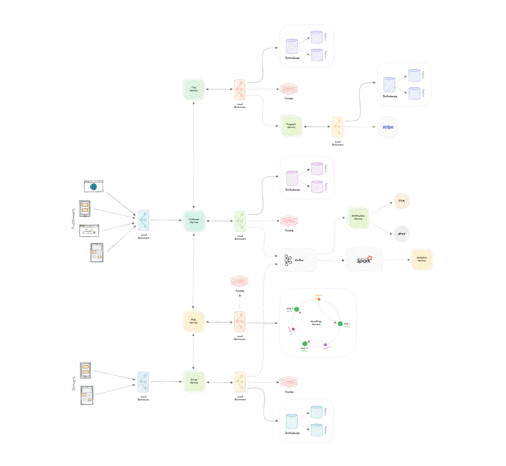

## 🧩 1. Gather Requirements (10–15 mins)

### ✅ Functional Requirements (FR):

#### 👤 Rider Side:
- Signup/login
- Set pickup/drop location
- View fare estimate and ETA
- Request/cancel ride
- Track ride in real time
- Make payment (in-app, cash, UPI, wallet)
- Rate driver and view ride history

#### 🚗 Driver Side:
- Driver login
- Accept/reject ride requests
- Navigation to rider pickup & drop location
- Update ride status (arrived, started, completed)
- View earnings and history

#### 🧠 Admin/Backend:
- Driver onboarding and approval
- Monitor system usage, abuse detection
- Dynamic pricing (surge pricing)
- Support dashboard for disputes

---

### ⚙️ Non-Functional Requirements (NFR):

| Requirement              | Details |
|--------------------------|---------|
| Latency                  | <300ms for matching and updates |
| Availability             | Very high (mission critical service) |
| Scalability              | 100M+ users, real-time tracking |
| Consistency vs Availability | Prioritize availability with eventual consistency |
| Read/Write Ratio         | Near even (location updates = high write) |
| Geo-distributed          | Yes, city-wise zones |
| Security                 | Encryption for PII and payment data |

---

## 📦 2. API Design (3–5 mins)

### 👤 Rider APIs
```http
POST /signup
POST /login
GET /rides/estimate?pickup=..&drop=..
POST /rides/request
GET /rides/:ride_id/status
POST /rides/:ride_id/cancel
POST /rides/:ride_id/rate
```

### 🚗 Driver APIs
```http
POST /driver/login
GET /driver/assignments
PATCH /rides/:ride_id/status (accepted, arrived, started, completed)
GET /driver/earnings
```

---

## 🏗️ 3. High-Level Design and Discussion (15–20 mins)

### 🎨 Clients:
- Rider app, Driver app, Admin dashboard (web)

---

### 🧊 CDN:
- For static files: app assets, vehicle images, driver license uploads.

---

### 🧮 Load Balancer:
- Routes traffic to appropriate backend services.

---

### 🧰 Microservices:
| Service              | Description |
|----------------------|-------------|
| **User Service**     | Rider/driver profiles, auth |
| **Ride Matching Service** | Matches riders to nearby drivers using geospatial index |
| **Location Service** | Real-time location tracking |
| **Pricing Service**  | Fare calculation, surge pricing |
| **Trip Service**     | Trip lifecycle (request → complete) |
| **Payment Service**  | Payments, invoices, refunds |
| **Rating Service**   | Feedback, star rating system |
| **Notification Service** | SMS, push notifications |
| **Analytics & Fraud** | Behavior monitoring and abuse detection |

---

### 🗄️ Databases:
| DB Name              | Type         | Purpose |
|----------------------|--------------|---------|
| User DB              | SQL (PostgreSQL) | Rider/driver details |
| Ride DB              | NoSQL (MongoDB/DynamoDB) | Active and historical rides |
| Location DB          | Redis + PostGIS | Real-time location indexing |
| Pricing DB           | SQL           | Region-based base fare, surge data |
| Payments DB          | SQL           | Payment records, invoices |

---

### 🚦 Queues & Events:
Use Kafka or RabbitMQ for:
- Driver assignment
- Trip status events
- Notification triggers
- Fraud alerts

---

### 🧠 Real-Time Tracking:
- WebSockets/MQTT for bidirectional communication between rider and driver.
- Store location updates in Redis with TTL (for only recent updates).

---

### 🧭 Driver Matching (Core Logic):
- Use a **geospatial index** (like Uber’s H3, or PostGIS) to:
  - Index driver locations
  - Match with nearest available drivers within a radius
  - Prioritize low ETA + driver rating

---

## 📊 4. Metric Estimation (5 mins)

Let’s estimate for a major city like Bengaluru:

| Metric                 | Estimate |
|------------------------|----------|
| Daily Active Users     | 5 million |
| Concurrent trips       | ~200K |
| Location updates       | 2/sec × 200K = 400K writes/sec |
| Ride requests          | 20/s in a city |
| Payment volume         | $10M+/day globally |
| Peak load QPS          | 10K–50K QPS depending on region |
| Image uploads/storage  | Driver docs = 100s of GB/month |
| Caching layer          | Redis cluster with geospatial queries |





---

✅ **This architecture** ensures:
- Real-time location accuracy
- Scalable matching algorithm
- High fault tolerance
- Elastic surge pricing logic
- Smooth rider/driver experience

---